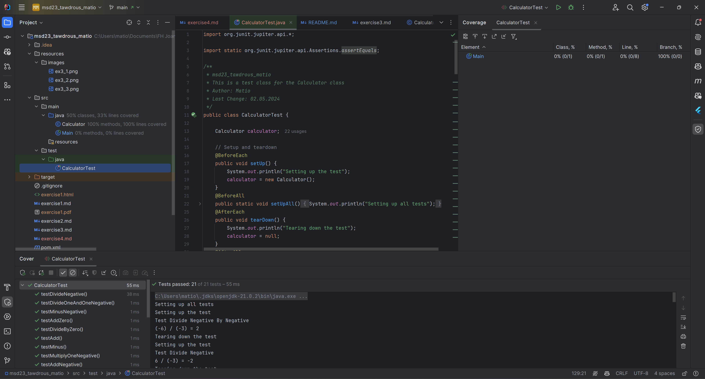

# Exercise 4

### 1. Voraussetzungen
___
Das Calculator Projekt von [Exercise 3](./exercise3.md) der vorherigen Übung wird benötigt. In [pom.xml](./pom.xml) muss das Plugin `junit-jupiter-api`, `junit-jupiter-engine` und `junit-jupiter-params` hinzugefügt werden.

```xml
<dependency>
    <groupId>org.junit.jupiter</groupId>
    <artifactId>junit-jupiter-api</artifactId>
    <version>5.10.2</version>
    <scope>test</scope>
</dependency>
<dependency>
    <groupId>org.junit.jupiter</groupId>
    <artifactId>junit-jupiter-engine</artifactId>
    <version>5.10.2</version>
    <scope>test</scope>
</dependency>
<dependency>
    <groupId>org.junit.jupiter</groupId>
    <artifactId>junit-jupiter-params</artifactId>
    <version>5.10.2</version>
    <scope>test</scope>
</dependency>
```
___

### 2. JUNIT Tests
___

1. In dem Package `test` wird eine neue Klasse `CalculatorTest` erstellt.
2. Mit den Annotations `@BeforeEach` und `@AfterEach` wird die Methode `setUp` und `tearDown` erstellt. In der `setUp` Methode wird ein neues Objekt der Klasse `Calculator` erstellt und in der `tearDown` Methode wird das Objekt wieder auf `null` gesetzt.
3. Mit den Annotations `@BeforeAll` und `@AfterAll` wird die Methode `setUpAll` und `tearDownAll` erstellt. In der `setUpAll` wird auf der Konsole `Setting up all tests` ausgegeben und in der `tearDownAll` wird auf der Konsole `Tearing down all tests` ausgegeben.
4. In dieser Klasse werden die Testmethoden für die Methoden `add`, `minus`, `multiply` und `divide` erstellt.
5. Die Testmethoden werden mit der Annotation `@Test` versehen und mit den Assertions von JUNIT getestet.

```java
public void testAdd() {} // Testmethode für die Methode add
public void testAddNegative() {} // Testmethode für die Methode add mit einer negativen Zahl
public void testAddBothNegative() {} // Testmethode für die Methode add mit zwei negativen Zahlen
public void testAddZero() {} // Testmethode für die Methode add mit zwei 0

public void testMinus() {} // Testmethode für die Methode minus
public void testMinusNegative() {} // Testmethode für die Methode minus mit einer negativen Zahl
public void testMinusBothNegative() {} // Testmethode für die Methode minus mit zwei negativen Zahlen
public void testMinusZero() {} // Testmethode für die Methode minus mit zwei 0

public void testMultiply() {} // Testmethode für die Methode multiply
public void testMultiplyOneNegative() {} // Testmethode für die Methode multiply mit einer negativen Zahl
public void testMultiplyBothNegative() {} // Testmethode für die Methode multiply mit zwei negativen Zahlen
public void testMultiplyAnythingWithZero() {} // Testmethode für die Methode multiply mit einer 0
public void testMultiplyZero() {} // Testmethode für die Methode multiply mit zwei 0

public void testDivide() {} // Testmethode für die Methode divide
public void testDivideOneAndOneNegative() {} // Testmethode für die Methode divide mit einer negativen Zahl
public void testDivideOneNegativeAndOne() {} // Testmethode für die Methode divide mit einer negativen Zahl reverse
public void testDivideNegative() {} // Testmethode für die Methode divide mit zwei negativen Zahlen
public void testDivideZero() {} // Testmethode für die Methode divide mit zwei 0
public void testDivideByZero() {} // Testmethode für die Methode divide durch 0
public void testDivideZeroByZero() {} // Testmethode für die Methode divide 0 durch 0
public void testDivideNegativeByZero() {} // Testmethode für die Methode divide eine negative Zahl durch 0
```
___
### 3. Screenshot des Testruns mit Coverage:
</img>
___

